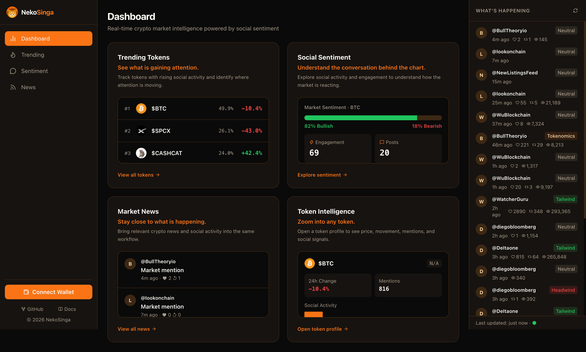

# Neko Singa — App

Frontend dashboard for Neko Singa — real-time crypto market intelligence powered by social sentiment. Built as a direct response to the [Full-Stack Engineer (Frontend-Leaning)](https://www.elfa.ai/careers/full-stack-engineer) role at Elfa AI.

**Live (Production):** [app-nekosinga.vercel.app](https://app-nekosinga.vercel.app/) — see status note below  
**API Backend:** [api-nekosinga.vercel.app](https://api-nekosinga.vercel.app/) — live and responding

---

## Current Status

| Environment | Status | Notes |
|---|---|---|
| Local (`localhost:3001`) | ✅ Working | Full data load — trending tokens, news feed, wallet connect button |
| Production (`app-nekosinga.vercel.app`) | 🔧 In Progress | CORS issue between frontend and API — being resolved |

### What it looks like when connected (local):

The dashboard renders trending tokens ranked by social mindshare, real-time percentage changes, mini sparkline charts, and a live news/mentions feed on the right panel — all pulling real data from the Elfa API via the backend.

---

## What's Happening in Production

The frontend and backend are deployed as separate projects on Vercel (`app-nekosinga.vercel.app` and `api-nekosinga.vercel.app`). Because they're on different subdomains, the browser enforces CORS — the backend must explicitly allow requests from the frontend's origin.

### Timeline of the issue

1. `FRONTEND_URL` env var in the `api` project was initially set with a trailing slash (`https://app-nekosinga.vercel.app/`). Browsers send the `Origin` header without a trailing slash — so the CORS check was failing silently even though the value looked correct.
2. After fixing the trailing slash, the backend hadn't been redeployed — so the old config was still running in production.
3. Vercel runtime logs for `api` showed **zero incoming requests** during the error window — confirming the browser was blocking at the preflight stage before requests ever reached the server.
4. Fix in progress: updating `src/index.ts` to explicitly handle OPTIONS preflight requests and hardcode the production frontend URL as a fallback alongside `process.env.FRONTEND_URL`, then redeploy.

This is a deployment config issue, not a code logic issue. Production should match local once the fix is deployed.

---

## Tech Stack

| Layer | Technology | Purpose |
|---|---|---|
| Framework | Next.js + TypeScript | UI & routing |
| Styling | Tailwind CSS | Design system, brand palette |
| Auth / Wallet | `@privy-io/react-auth` | Multi-method login (wallet, email, Google, Twitter) |
| On-chain Data | `wagmi` + `viem` | Read on-chain data after wallet connect |
| State / Fetch | `@tanstack/react-query` | Data fetching & caching |
| Chart | `lightweight-charts` | Price/candlestick charts |
| Data Source | `nekosinga/api` | Trending tokens, sentiment, news |

---

## Design

Dark theme with orange accent (`#F97316`) derived directly from the Neko Singa brand logo. Inspired by the Elfa product UI — data-dense layout, token rankings with sparklines, and a live news panel on the right. See [`design.md`](./design.md) for full color tokens and component patterns.

---

## What's Next (v1 Remaining)

- [ ] **Fix production CORS** — CORS config update already written, pending redeploy of `api`
- [ ] **Token detail page** — click any token row → candlestick chart + sentiment/mentions toggle (via `lightweight-charts` + `/api/market/sentiment/:token`)
- [ ] **Wallet connect flow** — "Connect Wallet" button in UI, Privy integration in progress
- [ ] **Token icons via CoinGecko** — replace current fallback badges with real icons via `/api/market/icon/:symbol` (proxy + 24h Redis cache)

---

## What's Out of Scope (v1)

- **AI Chat** — Elfa's AI Chat endpoint (`elfa.chat`) requires their Grow plan ($290/mo). Planned as v2 milestone — architecture is scaffolded, just needs a plan upgrade to activate. See the [`api` README](https://github.com/nekosinga/api) for full context.
- **Live order book / trade execution** — requires a WebSocket connection to Hyperliquid exchange, out of scope for this build.
- **TradingView Advanced Charts** — the full charting library requires a formal approval process. Using `lightweight-charts` (open-source, same publisher) as the practical alternative.

---

## Related Repos

Part of the `nekosinga` polyrepo:
- [`api`](https://github.com/nekosinga/api) — Express backend, Elfa SDK, Postgres, Redis
- [`web`](https://github.com/nekosinga/web) — landing page
- [`docs`](https://github.com/nekosinga/docs) — documentation
